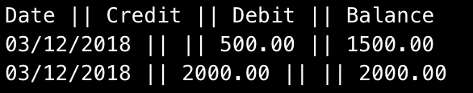

# Bank Test
A simple banking command line app that allows a user to:
- Deposit and withdraw money
- Check their balance
- Check their account statement

## Getting set up

1. Clone this repo git clone `https://github.com/Caitlin-cooling/bank_test`
2. Change in to the directory `cd bank_test`
3. Open `irb`
4. Require the account and statement files: `./lib/account.rb` and `./lib/statement.rb`

## Using the app

1. Create a new account `account = Account.new`
2. Deposit money in to the account `account.deposit(2000)`
3. Withdraw money from the account `account.withdraw(500)`
4. Create a new statement, remember to pass in your account `statement = Statement.new(account)`
5. View the account statement `puts statement.view`

## How to run the tests
Tests are written using RSpec. Once you are in the correct directory, run `rspec` from the command line. SimpleCov is set up in the console so you will see a test coverage metric when you run this command.

## Technologies used
This app is written in Ruby, uses RSpec for testing and SimpleCov for test coverage metric. It uses RuboCop as a linter.

## My approach to this challenge
My approach to this challenge was to first diagram the simplest possible scenario that would meet the users requirements, which I then test drove following the red/green/refactor cycle.

Then I refactored the code to ensure single responsibility of classes in an Object Orientated manner.
